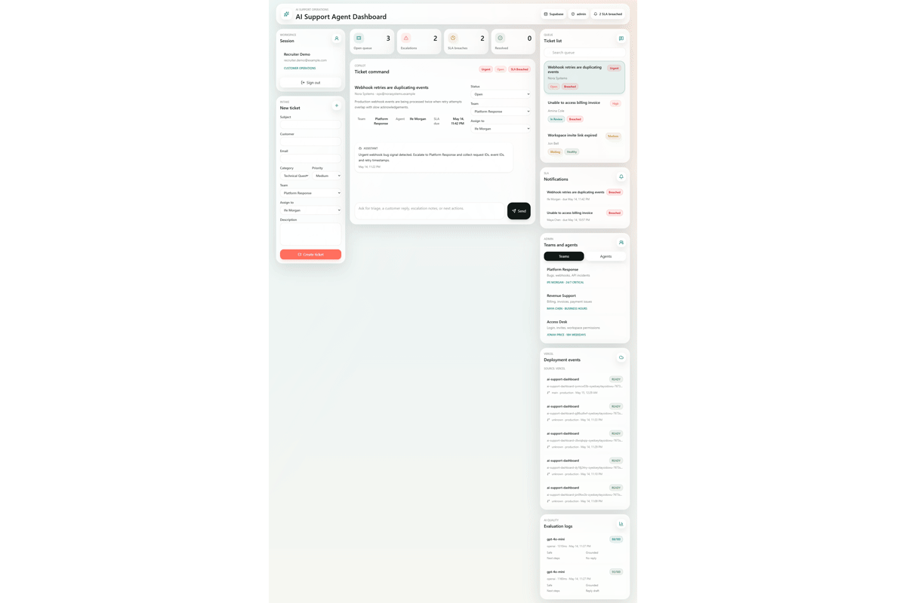
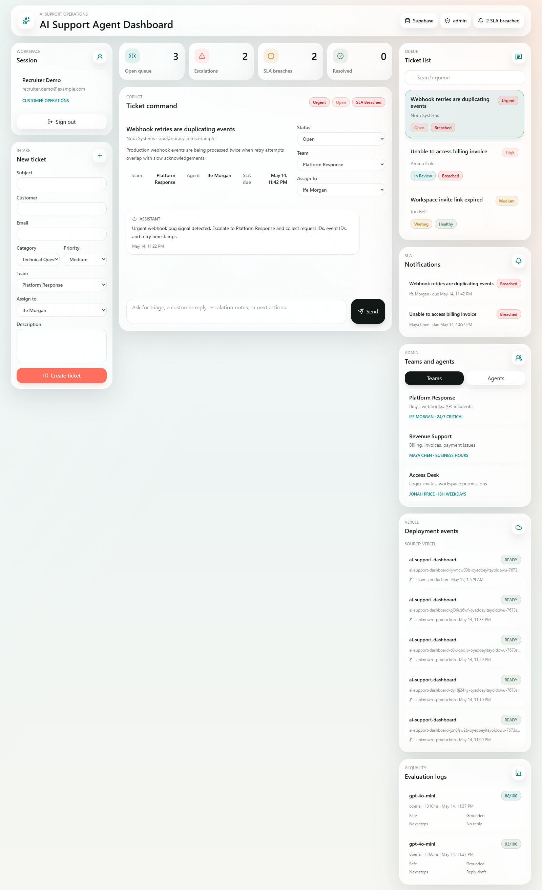
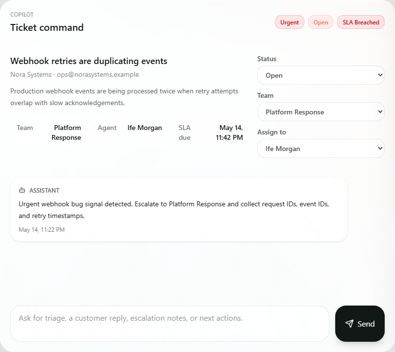
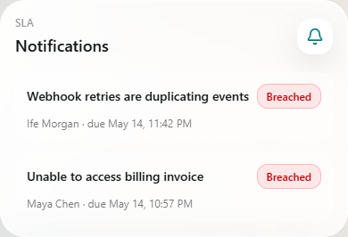
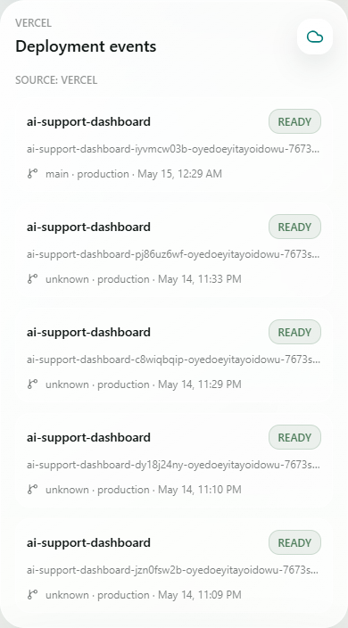
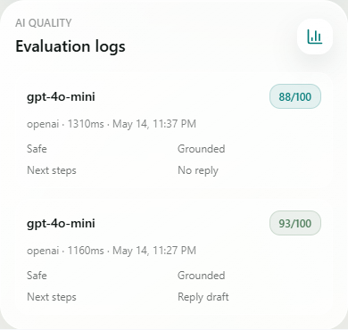
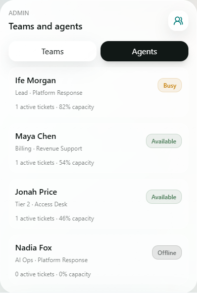
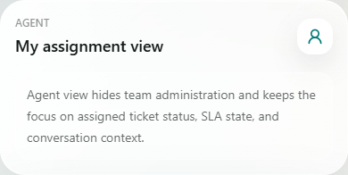
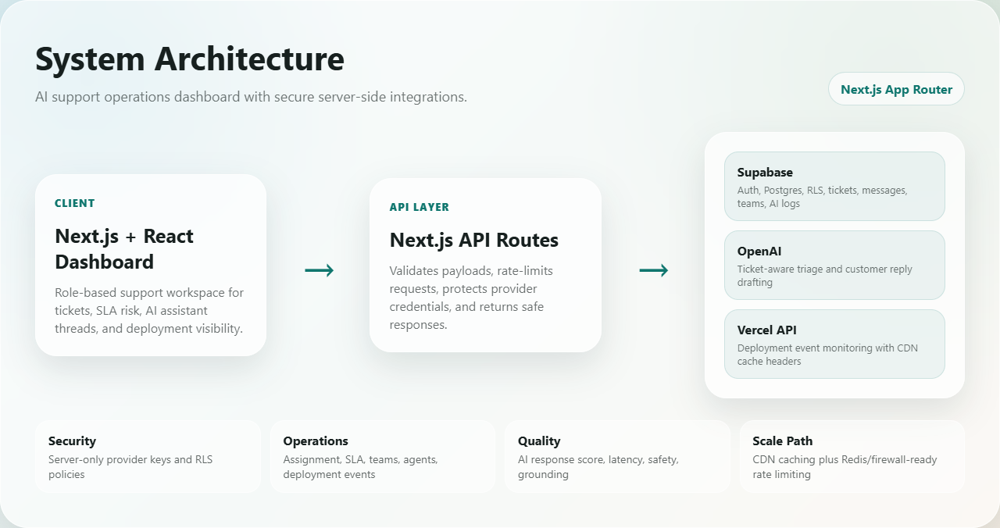
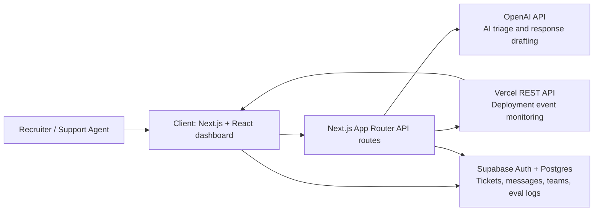

# AI Support Agent Dashboard

[](https://nextjs.org/)
[](https://react.dev/)
[](https://supabase.com/)
[](https://platform.openai.com/)
[](https://vercel.com/)
[](SECURITY_AUDIT.md)

An AI-assisted support operations dashboard built with Next.js 16, React 19, Tailwind CSS 4, Supabase-ready authentication, ticket storage, role-based operations views, Vercel deployment monitoring, and a server-side OpenAI SDK route that keeps provider credentials out of the browser.

This is a portfolio MVP designed to show modern AI tooling, backend integration, deployment workflows, security awareness, admin operations, and professional product thinking.

## Visual Walkthrough

<p align="center">
  
</p>

<p align="center">
  <a href="https://ai-support-dashboard-navy.vercel.app"><strong>Live Demo</strong></a>
  ·
  <a href="#screenshots"><strong>Screenshots</strong></a>
  ·
  <a href="#architecture"><strong>Architecture</strong></a>
  ·
  <a href="#security-audit"><strong>Security Audit</strong></a>
</p>

## Project Overview

The dashboard helps a SaaS support team manage tickets, assign work to agents, monitor SLA risk, review deployment health, and use an AI assistant for triage and response drafting. It runs immediately in local demo mode, then connects to Supabase, OpenAI, and Vercel when environment variables are configured.

## Live Demo

- Production: [https://ai-support-dashboard-navy.vercel.app](https://ai-support-dashboard-navy.vercel.app)
- Demo Admin email: `recruiter.demo@example.com`
- Demo Admin password: `DemoAccess!2026`
- Local demo mode: run the app without Supabase environment variables, sign in with any email plus an 8+ character password, then switch between Admin and Agent in the demo role selector.

The live demo account is seeded with sample support tickets, teams, agents, conversation threads, Vercel deployment events, SLA risk states, and AI evaluation logs. Treat these credentials as public portfolio-demo credentials only.

## Why I Built This

I built this project to demonstrate that I can move beyond tutorial apps and create a realistic AI operations product: authenticated workflows, role-aware dashboards, server-side AI integration, production deployment monitoring, database security, testing, and recruiter-friendly technical documentation.

The goal was to show how AI can fit into a real support workflow without exposing provider secrets, losing ticket context, or ignoring operational concerns like assignment, SLA risk, deployment health, rate limiting, and quality evaluation.

## Features

- Login/signup interface with Supabase auth integration points
- AI support chatbot with selected-ticket context
- Real AI evaluation logging for response quality, safety, grounding, and latency
- Ticket submission, queue management, assignment, and status updates
- Role-based admin views for support teams and agents
- Agent-focused assignment view for non-admin support users
- SLA due dates, breach counts, due-soon states, and breach notifications
- Per-ticket conversation threads persisted in the UI
- Vercel deployment event monitoring with a demo fallback
- Supabase schema with row-level security policies
- Professional Apple-inspired glass interface
- Recoverable app error screen for runtime failures
- Security headers, API rate limiting, and safe cache headers for deployment monitoring
- Integration tests for the AI route, ticket creation flow, and Vercel monitoring route

## Tech Stack

- Next.js 16
- React 19
- TypeScript 6
- Tailwind CSS 4
- Supabase JS 2
- OpenAI SDK 6
- Zod 4
- Lucide React 1
- Vitest 4
- Testing Library
- Vercel REST API
- Vercel CDN caching headers

## Skills And Design Systems Used

- `frontend-design`: used to keep the dashboard information-dense, responsive, and production-focused rather than landing-page styled.
- `liquid-glass-design`: used to guide the Apple-inspired glass material, translucent panels, blur, depth, and interactive glass controls.
- `apple-hig`: used to keep the interface calm, readable, touch-friendly, and aligned with familiar Apple-style hierarchy.
- `codex-security:security-scan`: used to review auth boundaries, AI endpoint exposure, Supabase RLS policies, local storage behavior, provider error handling, dependency health, and production hardening notes.
- `playwright`: used to capture production screenshots and generate a recruiter-ready dashboard walkthrough GIF.
- `github:github`: used to prepare the repository for public presentation and publishing.

## Updated Files

- `package.json`: upgraded the stack, added Vitest scripts, and changed `npm run dev` to use webpack for local stability. `npm run dev:turbo` remains available for Turbopack testing.
- `package-lock.json`: refreshed dependency lockfile after stack and test dependency upgrades.
- `src/components/support-dashboard.tsx`: rebuilt the main dashboard with Apple-inspired glass UI, role-based admin and agent views, ticket assignment, SLA notifications, per-ticket conversation threads, and Vercel deployment monitoring.
- `src/components/support-dashboard.test.tsx`: added an integration-style ticket creation test that verifies assignment-aware ticket creation, per-ticket thread persistence, and visible SLA breach notifications.
- `src/app/api/ai-support/route.ts`: moved provider calls to the OpenAI SDK, tightened request validation, added optional bearer-token enforcement, stopped returning upstream provider details to clients, and records AI evaluation logs.
- `src/app/api/ai-support/route.test.ts`: added API route tests for demo-mode AI responses, invalid request handling, production auth enforcement, rate limiting, and evaluation metadata.
- `src/app/api/vercel/deployments/route.ts`: added a server-side Vercel deployments route that reads Vercel credentials from environment variables, rate limits requests, returns cache headers, and falls back to demo data when credentials are missing.
- `src/app/api/vercel/deployments/route.test.ts`: added route coverage for cached deployment monitoring fallback behavior.
- `src/lib/rate-limit.ts`: added a bounded per-instance fixed-window limiter for public API routes.
- `src/app/globals.css`: migrated to Tailwind CSS 4 with CSS-first theme tokens and reusable glass UI classes.
- `src/app/layout.tsx`: switched to a system font stack to prevent remote Google font fetch failures during production builds.
- `src/app/error.tsx`: added a recoverable runtime error screen to reduce user-facing crashes.
- `src/lib/types.ts`: expanded shared types for teams, agents, SLA-aware tickets, conversation thread maps, deployment events, and AI evaluation logs.
- `src/lib/demo-data.ts`: added realistic demo teams, agents, assigned tickets, conversation threads, deployment events, and AI evaluation logs.
- `src/lib/operations.ts`: added shared helpers for SLA calculation, SLA state, assignment counts, display names, and deployment status normalization.
- `supabase/schema.sql`: added support teams and agents tables, ticket assignment fields, SLA due dates, AI evaluation logs, performance indexes, and tighter row-level security policies.
- `vitest.config.ts`: configured Vitest with jsdom and the project alias.
- `vitest.setup.ts`: added Testing Library cleanup, matcher setup, local storage resets, and fetch stubs for integration tests.
- `next.config.mjs`: enabled production security headers and disabled the default powered-by header.
- `postcss.config.mjs`: migrated PostCSS configuration to `@tailwindcss/postcss`.
- `.env.example`: added AI auth and Vercel deployment monitoring environment variables.
- `.gitignore`: blocks `.env`, `.env.*`, `.env*.local`, `.venv`, `venv`, `.vercel`, `.next`, `node_modules`, and local logs from public commits.
- `.vercelignore`: blocks env files, virtualenv folders, local logs, dependencies, and build output from Vercel deployment uploads.
- `SECURITY_AUDIT.md`: records the latest pre-public security audit, validation evidence, and remaining production hardening guidance.
- `README.md`: updated documentation, audit notes, stack details, feature list, project changes, and verification results.
- `docs/assets/dashboard-demo.gif`: adds a short animated walkthrough for the GitHub README.
- `docs/assets/architecture.png`: adds a polished system architecture image for the README.
- `docs/assets/screenshots/*.png`: adds production screenshots for the dashboard, AI assistant, deployment monitor, SLA notifications, and AI evaluation logging.

## Screenshots

| Dashboard Overview | AI Assistant |
| --- | --- |
|  |  |
| Full support operations view with tickets, SLA risk, deployment health, role-aware controls, and AI quality metrics. | Ticket-aware AI assistant with conversation history, support guidance, response drafting, and evaluation metadata. |

| SLA Notifications | Deployment Monitor |
| --- | --- |
|  |  |
| Breached and due-soon tickets surface clearly for support operations review. | Server-side Vercel integration shows live deployment events without exposing Vercel tokens. |

| AI Evaluation Logs |
| --- |
|  |
| Response quality is logged with score, latency, safety, grounding, next-step detection, and customer-reply detection. |

| Admin Agent Management | Agent Assignment View |
| --- | --- |
|  |  |
| Admins can inspect team capacity, agent status, and active ticket load. | Agent mode hides administration and focuses on assigned work, SLA state, and ticket context. |

## Recruiter Highlights

- AI operations workflow with real ticket context and response evaluation.
- Supabase authentication, Postgres schema, indexes, and row-level security.
- Server-side OpenAI and Vercel integrations with secrets kept out of the browser.
- Role-based admin and agent views for realistic support team operations.
- Deployment-ready Next.js app with tests, security audit notes, and live demo credentials.

## Architecture

The application uses the Next.js App Router.

<p align="center">
  
</p>



- Frontend: `src/components/support-dashboard.tsx` renders the dashboard, auth panel, ticket queue, intake form, admin views, agent assignment view, SLA notifications, deployment monitor, and chat interface.
- AI backend: `src/app/api/ai-support/route.ts` keeps the AI API key server-side, validates request payloads with Zod, and uses the OpenAI SDK for provider calls.
- Vercel backend: `src/app/api/vercel/deployments/route.ts` calls the Vercel deployments API from the server so Vercel tokens are never exposed to the browser.
- Database: `supabase/schema.sql` defines profiles, support teams, support agents, support tickets, conversation messages, and AI evaluation logs with row-level security plus indexes for common high-traffic queries.
- Local fallback: browser local storage keeps the app usable before Supabase credentials are added. Storage writes are best-effort so blocked browser storage does not crash the UI.
- Caching: deployment monitoring responses use `s-maxage=60` and `stale-while-revalidate=300` so Vercel can serve cached deployment data during traffic spikes.
- Rate limiting: public API routes use a bounded fixed-window limiter to slow abusive traffic. For very high production traffic, move this to a shared store such as Redis or a Vercel Firewall rule.
- Error boundary: `src/app/error.tsx` provides a recoverable runtime error screen.
- Tests: Vitest and Testing Library cover the AI route, Vercel monitoring route, and the ticket creation flow.

## Database Design

The Supabase schema includes:

- `profiles`: support users and roles
- `support_teams`: operational teams such as Tier 1, Billing, and Platform Reliability
- `support_agents`: assignable support agents linked to teams
- `support_tickets`: customer issue records with priority, status, category, sentiment, assignment fields, and SLA due dates
- `conversation_messages`: user and assistant messages linked to tickets
- `ai_evaluation_logs`: AI response quality records linked to users and optional tickets

Row-level security limits records to the authenticated user and prevents conversation messages from being attached to tickets owned by another user.

Indexes support common production queries by user, status, priority, team, assigned agent, SLA due date, ticket creation time, and message creation time.

## Deployment Process

1. Push the project to GitHub.
2. Create a Supabase project and run `supabase/schema.sql` in the SQL editor.
3. Create a Vercel project and generate a Vercel token for deployment monitoring.
4. Add the environment variables in Vercel.
5. Import the GitHub repository into Vercel.
6. Deploy the app and test ticket creation, assignment, SLA notifications, deployment monitoring, and AI assistant responses.

Required environment variables:

```env
NEXT_PUBLIC_SUPABASE_URL=
NEXT_PUBLIC_SUPABASE_ANON_KEY=
OPENAI_API_KEY=
OPENAI_MODEL=gpt-4o-mini
REQUIRE_AI_AUTH=true
VERCEL_TOKEN=
VERCEL_PROJECT_ID=
VERCEL_TEAM_ID=
```

`VERCEL_TEAM_ID` is optional. Use it when the monitored project belongs to a Vercel team.

## Current Deployment

Production URL:

```text
https://ai-support-dashboard-navy.vercel.app
```

The current Vercel project is linked as `oyedoeyitayoidowu-7673s-projects/ai-support-dashboard`. The production environment currently has Supabase, OpenAI, Vercel deployment monitoring, and `REQUIRE_AI_AUTH=true` configured in Vercel. No Supabase, OpenAI, or Vercel provider secrets are stored in the repository or local project files.

Deployment monitoring is connected through server-side Vercel environment variables. Do not commit Vercel tokens to Git.

## AI Workflow

The chat form sends the recent conversation and selected ticket context to `/api/ai-support`. The server route applies a support-operations system prompt and returns triage guidance, investigation steps, and a draft customer reply.

If `OPENAI_API_KEY` is missing, the route returns a deterministic demo response. This makes the project reviewable without exposing secrets.

Keep `REQUIRE_AI_AUTH=true` in production so AI requests require a valid Supabase session token. For local demo-only testing without Supabase, you can temporarily set it to `false`.

## AI Evaluation Logging

Each assistant response produces an evaluation record with request ID, model, latency, approximate prompt and response word counts, safety status, ticket-grounding status, next-step detection, customer-reply detection, score, and reviewer notes.

When the user is authenticated, `/api/ai-support` writes the evaluation record to Supabase using the user's bearer token, so row-level security still controls access. The dashboard also displays recent evaluation logs in the right rail so reviewers can see that AI quality is treated as an operational metric, not a hidden black box.

## Operations Workflow

- Admin users can switch between team and agent views.
- Admin users can assign tickets to support teams and agents.
- Agent users see an assignment-focused view instead of admin operations controls.
- New tickets receive an SLA due date based on priority.
- Breached and due-soon tickets surface in the SLA notification panel.
- Each ticket has its own conversation thread, so switching tickets preserves the correct chat context.
- Vercel deployment monitoring displays recent deployments, branch names, commit metadata, status, and deployment URLs.

## Repository Topics

Recommended GitHub topics for this project:

`ai-dashboard`, `nextjs`, `supabase`, `openai`, `vercel`, `typescript`, `ai-operations`, `support-dashboard`, `tailwindcss`, `devops`, `react`, `saas`, `portfolio-project`, `rls`, `security`, `vitest`

Suggested GitHub description:

```text
AI-assisted support operations dashboard with OpenAI, Supabase, role-based workflows, SLA monitoring, and Vercel deployment observability.
```

## Security Considerations

- AI API keys stay on the server.
- Vercel tokens stay on the server.
- Supabase row-level security policies are included.
- Client-side Supabase keys are limited to public anon usage.
- The AI route validates request shape with Zod.
- The AI route validates Supabase session tokens when `REQUIRE_AI_AUTH=true`.
- Public API routes include rate limiting headers.
- AI route responses use `Cache-Control: no-store` so ticket context and assistant replies are not shared-cached.
- Vercel deployment monitoring uses short CDN caching because deployment metadata is operational, not customer-private ticket data.
- AI provider errors are logged server-side and returned to the client as generic failures.
- Vercel API failures fall back to safe demo data instead of crashing the dashboard.
- Production responses include security headers for HSTS, frame blocking, content-type sniffing protection, referrer policy, and browser permission restrictions.
- The README avoids encouraging storage of secrets in Git.

## Security Audit

Last reviewed: May 15, 2026.

### Checks Completed

- `npm run lint` passed.
- `npm run test` passed with 7 tests across 3 test files.
- `npm run build` passed.
- `npm audit --omit=dev` reported `0 vulnerabilities`.
- Secret scan found no committed OpenAI, Supabase, or Vercel tokens.
- Git ignore checks confirmed `.env`, `.env.local`, `.env.production`, and `.venv` are excluded from Git.
- Vercel ignore rules exclude env files, virtualenv folders, local logs, dependencies, and build output from deployment uploads.
- Production Vercel smoke test returned `HTTP 200` for the deployed app.
- Production Vercel AI route returned `401` without authentication.
- Production Vercel AI route returned `401` for a fake bearer token.
- Production Vercel deployment monitoring returns live Vercel data.
- Invalid AI API payloads correctly return `400`.
- Excessive AI requests return `429`.
- Bearer-shaped but unvalidated AI auth tokens do not pass production auth checks.
- The AI provider key is read only from `process.env.OPENAI_API_KEY` on the server.
- Vercel deployment monitoring reads credentials only from server-side environment variables.
- Vercel monitoring responses include CDN cache headers.
- Tailwind CSS 4 migration completed with `@tailwindcss/postcss`.
- App error boundary added to reduce user-facing crashes.
- Production screenshots and a README GIF were captured from the live deployment using the seeded recruiter demo account.

### Resolved Since First Audit

- Supabase profile upsert no longer sends a client-controlled `role` value.
- Conversation message insert policy now verifies that the referenced ticket belongs to the authenticated user.
- Supabase mode no longer persists tickets and messages to local storage.
- AI provider error details are no longer returned directly to clients.
- Role-based admin and agent views now separate admin operations from agent assignment views.
- Ticket assignment fields and SLA due dates are modeled in TypeScript and Supabase.
- AI evaluation logs are modeled in TypeScript, Supabase, seeded demo data, and the live dashboard UI.
- Integration tests now cover the AI route and ticket creation flow.
- `.env.*`, `.venv`, and `venv` are now explicitly ignored before public push.
- API rate limiting and production security headers are now enabled.
- AI auth now validates Supabase sessions instead of accepting any bearer-shaped token.

### Remaining Hardening

- Replace the in-memory limiter with a distributed limiter such as Upstash Redis or Vercel Firewall for multi-region, million-user production traffic.
- Fetch ticket context server-side instead of trusting client-submitted ticket data.
- Enforce admin-only team and agent mutation with server-side role checks before adding real write APIs.
- Add Vercel webhook ingestion for real-time deployment event updates.
- Add Playwright end-to-end tests for the deployed production flow.

## Scale And Caching Notes

The app is safe to deploy on Vercel as a portfolio MVP with CDN-backed static assets, cached deployment monitoring, and no-store AI responses. The current caching strategy avoids the dangerous mistake of globally caching private ticket data.

For traffic at million-user scale, add these production services before relying on the app for real customers:

- Distributed rate limiting through Redis, Vercel Firewall, or an API gateway.
- Server-side pagination for tickets and conversation messages.
- Database indexes on ticket owner, status, priority, team, assigned agent, SLA due date, and creation time.
- Background jobs or webhooks for SLA breach notifications instead of browser-only checks.
- Load testing with realistic ticket, auth, AI, and deployment-monitoring traffic.

## Challenges Faced

- Designing an MVP that works without paid API credentials.
- Keeping AI and Vercel provider calls server-side while preserving a responsive UI.
- Modeling ticket, assignment, SLA, deployment, and conversation storage for both local demo mode and Supabase.
- Creating a dashboard that feels operational instead of tutorial-like.
- Migrating from Tailwind CSS 3 configuration to Tailwind CSS 4 CSS-first tokens.
- Balancing a glass-style interface with readable contrast and dense operational data.
- Preventing local dev crashes by using webpack for `npm run dev` while keeping the normal production build flow.

## Lessons Learned

- AI features are stronger when tied to concrete workflow context.
- A recruiter-friendly project needs architecture notes, security notes, tests, and deployment details, not only screenshots.
- Local fallback behavior makes demos easier and improves resilience.
- Database policies should be part of the first implementation, not an afterthought.
- Role-based UI is clearer when admin operations and agent workflows are visibly different.
- SLA and deployment monitoring make the project feel closer to a real support operations tool.

## Future Improvements

- Add real Supabase CRUD screens for managing teams and agents.
- Add server-side ticket assignment APIs with stricter authorization checks.
- Add Slack or email notifications for SLA breaches.
- Add Vercel webhook ingestion for real-time deployment updates.
- Add Playwright end-to-end tests for authentication, ticket ownership, assignment, and deployment monitoring.
- Add charts for SLA trend, response time, and ticket volume analytics.

## Local Development

Install dependencies and start the dev server:

```bash
npm install
npm run dev
```

Then open `http://localhost:3000`.

`npm run dev` uses webpack because Turbopack dev mode caused a local Node/V8 out-of-memory crash on this machine. Production builds still use the normal Next.js build flow. To test Turbopack locally, run:

```bash
npm run dev:turbo
```

Run verification before pushing:

```bash
npm run lint
npm run test
npm run build
npm audit --omit=dev
```
